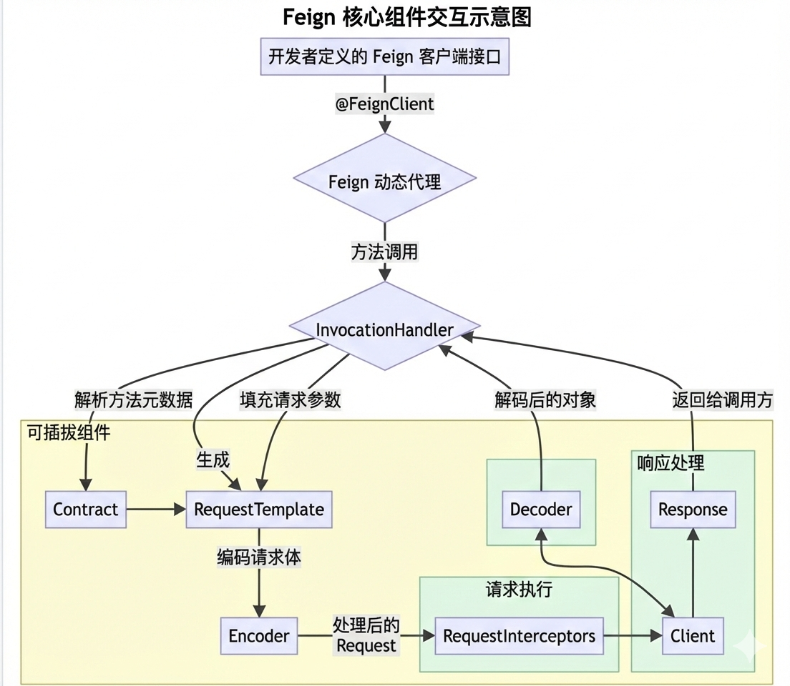

在微服务架构中，声明式 HTTP 客户端 OpenFeign 几乎是必备组件。很多人会用，但一旦碰到自定义拦截器、动态 URL 切换、或者诡异的序列化问题时，往往一头雾水。

市面上很多源码解析文章容易把 **Netflix Feign 原生核心**和 **Spring Cloud 包装层**混为一谈。本文旨在提供一份详尽的 Feign 源码解析，带您从宏观的架构设计到微观的代码实现，层层深入，揭开 Feign 的神秘面纱。

## 0. 认清双面人：核心理念与双层架构

在深入源码之前，我们首先需要理解 Feign 的核心设计理念，这有助于我们更好地把握其源码的组织方式。

- **Feign (原生核心)**：核心在于**声明式**。开发者通过定义一个 Java 接口，并使用注解来描述与远程 HTTP 服务的映射关系，Feign 会在运行时动态地为这个接口生成一个代理实现，该实现负责完成实际的 HTTP 请求和响应处理。它拥有高度模块化的设计，其核心组件都是可替换的。
- **Spring Cloud OpenFeign**：Spring 官方提供的一个"包装盒"。它负责把 Feign 集成到 Spring 容器中，让 Feign 能看懂 Spring MVC 的注解，并能够与服务发现、负载均衡以及熔断器等组件协同工作。

## 1. 宏观鸟瞰：核心组件协同作战

理解其核心组件及其交互方式，是通往源码殿堂的第一步。



**核心组件解析：**

- **`@FeignClient`**: 标记一个接口为 Feign 客户端，是 Feign 功能的入口。
- **动态代理 (Dynamic Proxy)**: Feign 通过 JDK 的动态代理技术，在运行时为被 `@FeignClient` 注解的接口创建一个代理实例。当开发者调用接口方法时，实际上是调用了代理实例的相应方法。
- **`InvocationHandler`**: 每个代理实例都关联一个 `InvocationHandler`。所有对代理实例方法的调用都会被转发到这里的 `invoke` 方法中，这是 Feign 发起远程调用的核心逻辑所在。
- **`Contract` (契约)**: 负责解析 Feign 客户端接口中的注解和方法签名，将其转换为统一的、与具体 HTTP 请求无关的方法元数据（`MethodMetadata`）。默认支持 Feign 自带注解，而 `SpringMvcContract` 则使其能够理解 Spring MVC 的注解。
- **`RequestTemplate`**: 包含了构建一个 HTTP 请求所需的所有信息，如请求方法、URL、请求头和请求体模板等。
- **`Encoder` (编码器) & `Decoder` (解码器)**: `Encoder` 负责将请求对象序列化为 HTTP 请求体。`Decoder` 负责将收到的 HTTP 响应体反序列化为 Java 对象。
- **`Client` (HTTP 客户端)**: 封装了底层的 HTTP 通信库，负责发送 `Request` 并接收 `Response`。默认使用 `HttpURLConnection`，但也支持替换为 `Apache HttpClient` 或 `OkHttp` 等。

## 2. 启动阶段：@EnableFeignClients 与装配魔法

当 Spring Boot 应用启动时，一切始于 `@EnableFeignClients`。 它会触发对指定包路径下被 `@FeignClient` 注解的接口的扫描。其背后的大管家 `FeignClientsRegistrar` 会执行一波"偷天换日"的操作：

对于每一个被发现的接口，Spring Cloud OpenFeign 会创建一个 `FeignClientFactoryBean`。这是一个 Spring 的 `FactoryBean`，负责创建和配置 Feign 客户端代理实例。它并不会直接注册你的接口，而是把配置（URL、拦截器等）塞进 FactoryBean 中，最后构建 `Feign.Builder`，并通过 `Proxy.newProxyInstance()` 生成动态代理。

## 3. 设计模式之美：负载均衡的"穿脱装备"

在构建 `Client` 时，Spring Cloud OpenFeign 展现了极具魅力的**装饰器模式**。

如果你的项目中引入了 Ribbon 或 Spring Cloud LoadBalancer，底层的 HTTP `Client` 默认会被穿上一层名为 `FeignBlockingLoadBalancerClient` 的外壳。 但这带来了一个问题：如果你在 `@FeignClient(url="http://localhost:8081")` 里硬编码了直连 URL 怎么办？

```java
// Spring Cloud OpenFeign 源码片段
if (client instanceof FeignBlockingLoadBalancerClient) {
    // 脱壳操作 (Unwrap)
    client = ((FeignBlockingLoadBalancerClient) client).getDelegate();
}
builder.client(client);
```

源码非常聪明地进行了判断：既然你硬编码了 URL，就不需要负载均衡的装饰器了。于是它调用 `getDelegate()`，把外层装饰器扒掉，直接暴露出里面最素颜、纯粹发 HTTP 请求的 Client。功能解耦得干净利落！

## 4. 调用与响应阶段：一次完整的源码之旅

当开发者调用 Feign 客户端接口的某个方法时，执行流程如下：

1. **拦截调用：** 所有的方法调用都会被 `FeignInvocationHandler.invoke()` 拦截。
2. **解析元数据：** 根据被调用的 `Method` 对象，从缓存中获取对应的 `MethodMetadata`。如果未命中，则会通过 `Contract` 解析该方法并缓存。
3. **填充模板：** 基于 `MethodMetadata` 创建一个 `RequestTemplate` 的副本，并根据方法的实际参数来填充模板中的变量（如路径参数、查询参数等）。
4. **编码请求体：** 如果有请求体，`Encoder` 会被调用，将请求对象序列化成字节数组，并设置相应的 `Content-Type` 请求头。
5. **应用拦截器：** 配置的 `RequestInterceptor` 会被依次调用，对 `RequestTemplate` 进行最后的修改，例如添加统一的认证头。
6. **执行请求：** `Client` 组件接收最终构建好的 `Request` 对象，通过底层的 HTTP 库发起网络请求。
7. **解码响应：** `Client` 接收到响应后封装成 `feign.Response` 对象。接着 `InvocationHandler` 调用 `Decoder` 的 `decode` 方法，将响应体反序列化为接口方法声明的返回类型。
8. **异常与返回：** 如果状态码非 2xx，调用 `ErrorDecoder` 处理。最后解码后的对象作为接口方法的返回值，返回给调用方。

## 5. 深入核心扩展点源码

通过查阅原生 `feign-core` 源码，我们可以看到这些扩展点的设计极度精简：

- **`feign.Client`**：只有一个核心方法 `Response execute(Request request, Options options) throws IOException;`。通过实现这个接口，我们可以集成任何 HTTP 通信库。
- **`feign.codec.Encoder`**：核心方法 `void encode(Object object, Type bodyType, RequestTemplate template)`。作用是将对象序列化，并将结果放入模板的 body 中。
- **`feign.codec.Decoder`**：核心方法 `Object decode(Response response, Type type)`。将响应体反序列化为指定的 Java 类型。
- **`feign.Contract`**：核心方法 `List<MethodMetadata> parseAndValidateMetadata(Class<?> targetType);`。它遍历接口中的所有方法，解析其上的注解，并生成方法元数据。

## 总结

通过对 Feign 源码的宏观架构、请求生命周期以及核心扩展点的解析，我们可以看到 Feign 的设计精髓在于其**面向接口的编程模型**和**高度可插拔的组件化架构**。这种设计不仅使得上层业务代码能够与底层的 HTTP 通信细节解耦，保持了代码的整洁和可维护性，同时也为框架的扩展和定制提供了极大的灵活性。
